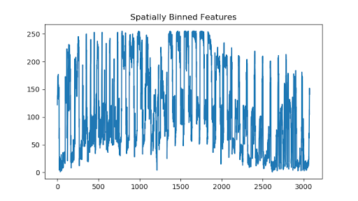
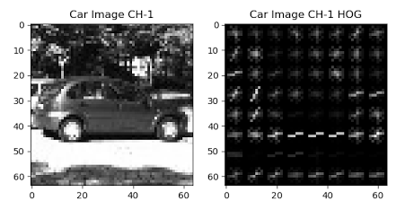
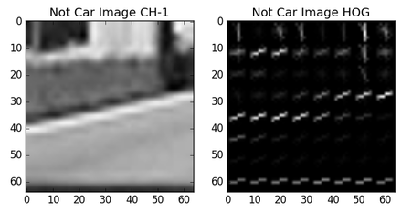
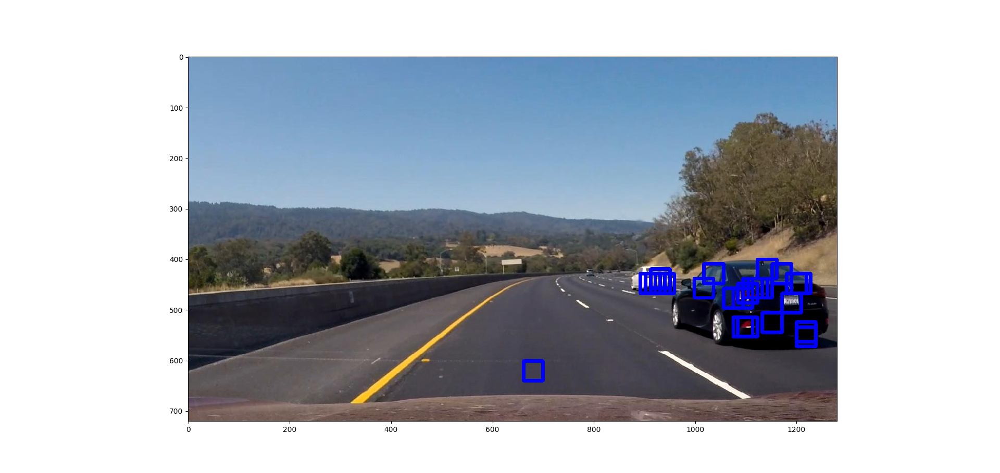
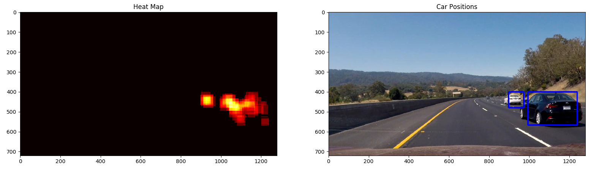

## Introduction
The aim of this project is to use advanced computer vision and machine learning to detect vehicles on the road. This project uses techniques like Histogram of Oriented Gradients, Color Transforms, Histogram of Colors and Binned Color Features on the images to form a feature vector. The project also uses machine learning models for predicting a vehicle based on the sliding window image feature vector passed in.

## Image Processing
### 1. Color Space
Images are usually represented in RGB color space but that is not a true representation of how humans perceive images. Humans are more sensitive to brightness than color. There are a lot color spaces which are designed to represent how humans perceive color but I decided to go with YCrCb because that gave me the highest accuracy when training my model.

> Code: extract_features.py

### 2. Histogram of Colors
Getting a histogram of colors of an image(in a particular color space) helps distinguishing certain objects like cars from other objects like buildings, roads etc. This type of histogram was used as part of the feature vector of an image for training, testing and prediction. I ended up spreading the colors over 32 histogram bins. Here is an example of how an histogram of colors of an image looks like.

> Code: spatial\_color\_features.py

  

  <i>Car</i>

  

  <i>Histogram of Colors*</i>

### 3. Spatial Binning of Color
In the lessons we learned about how template matching(comparing pixels) is not accurate as it tends to be too generic. But having the spatial bin representation of the image as part of the feature vector can show improvement in accuracy of classification. Here is an example of how the spatial bins of an YCrCb image looks like.

> Code: spatial\_color\_features.py

  

  <i>Car</i>

  

  <i>Spatial Binning Of Color</i>

### 4. HOG(Histogram of Oriented Gradients)
"The essential thought behind the histogram of oriented gradients descriptor is that local object appearance and shape within an image can be described by the distribution of intensity gradients or edge directions. The image is divided into small connected regions called cells, and for the pixels within each cell, a histogram of gradient directions is compiled. The descriptor is the concatenation of these histograms. For improved accuracy, the local histograms can be contrast-normalized by calculating a measure of the intensity across a larger region of the image, called a block, and then using this value to normalize all cells within the block. This normalization results in better invariance to changes in illumination and shadowing" - This is the description provided on Wikipedia.

It beautifully describes how HOG works. Although the original intention of HOG was for human detection, applying HOG on images to detect cars works really well. This is because cars have a distinct shape. I applied HOG using 9 orientations, 8x8 pixels per cell, 2x2 cells per block. Here are examples of HOG on car and not-car images.

> Code: hog\_features.py

  

  <i>HOG of Car</i>

  

  <i>HOG of Background</i>

## Classification
For classification I decided to use LinearSVM as it showed high accuracy in the lesson exercises. I stuck with the default parameters when creating a SVM object for training and testing. The dataset used for training and testing has cars and not-cars images from GTI and KITTI. The images are very small(64x64 pixels) and a feature vector combining HOG, Histogram of Colors(HOC) and Spatial Bins is used for training and testing the SVM model. The accuracy I got on my test data using Linear SVM and the combined feature vector was pretty high >99%.

> Code: classify\_images.py

  

<i>Car</i>

  

  <i>Not Car</i>

## Sliding Window
The training and testing was done on small images(64x64 pixels). The next step was to detect cars in an image using a sliding window, creating a feature vector(HOG, HOC and Spatial Bins) and passing the feature vector for predicting. If there was a car detected, a box is drawn on the image to indicate a car was found.

The problem with this approach is that calculating HOG is very computationally expensive and slows down the search. Instead the HOG was calculated for a certain area(400-656 pixel range along Y-axis) and then subsampling on the HOG matrix is applied for the specified window. This reduces computational time drastically and also allows applying different window sizes on the same image. I used window sizes which are [0.6, 0.75, 1.0] time 64x64 pixels.

Applying different window sizes enhances the confidence of prediction because if there are a lot of windows(of different sizes) clustered in the same narrow area, then there is high confidence that there is a car in that area. Here are examples of detection at different window sizes(note the spurious detections).

> Code: hog\_subsample.py

  <i>Window Size = 0.6x64 pixels</i>

    

  <i>Window Size = 0.75x64 pixels</i>

    

  <i>Window Size = 1.0x64 pixels</i>

## Hot Spots
One of the things which needs to be avoided is false positives from the previous step. To avoid false positives, I used different window scales, accumulated all the boxes. Then created a heat map to capture where the boxes were detected. Applied a threshold(of 5) to reject boxes which were "cooler". This ensured that false positives are rejected when a final bounding box is created to represent the cars in an image(as shown below).

> Code: apply_heat.py

  <i>Heat Map of Cars</i>

One of the issues I was running into was that for the same car the way the windows were two hot spots in close proximity. This meant my final heatmap-bounding boxes algorithm had to be modified to make sure that there was only one bounding box around each car.

## Final Result
Attached are 3 videos with this submission in the "report/FinalVideos" folder. The oututput of my model on the test\_video.mp4 & project\_video.mp4. The final video is the output combining the advanced lane detection and vehicle detection(LaneAndVehDet.mp4)

## Discussion
My algorithm works really great, the false positives are very small and the model does a really good job of identifying and putting a bounding box around the detected cars.

The following are things which can be improved or enhanced:

1. Making the bounding box smoother across cars
2. Reducing processing time by processing every other frame
3. Reduce the number false positives even more
4. Use a different machine learning model like a decision tree

I can also envision certain problems:

1. Detection during night time
2. Rapid change in light and background
3. Detecting other forms of vehicles like cycles, motorbikes & trucks

The algorithm can definitely be worked on to resolve issues I mentioned and make it robust.
